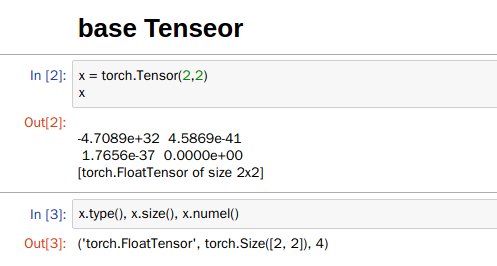
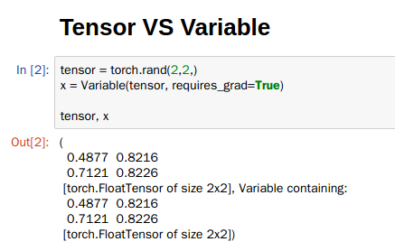
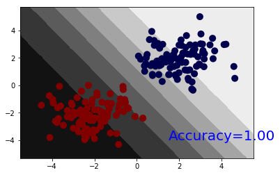
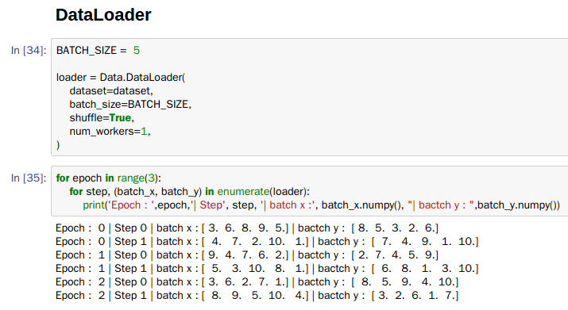
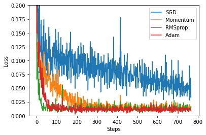
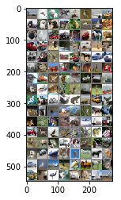
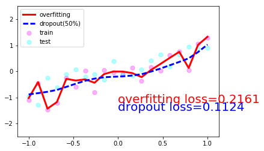

## What is PyTorch  
tensorflow와 같이 널리 사용되는 딥러닝 라이브러리 중 하나입니다. PyTorch는 tensorflow나 Keras보다 파이써닉합니다. Python의 배열 기능을 쉽게 사용할 수 있고 numpy/scipy 등과 뛰어난 호환성을 보입니다. 또한 더욱 깔끔한 코드 작성이 가능합니다. 이외에도 여러가지 장점이 있지만 제가 느끼는 가장 큰 장점들입니다. 그리고 대부분의 코드가 C++로 구현되어 있는 tensorflow와 다르게 PyTorch는 텐서 연산을 위한 C++코드를 제외하고는 대부분 Python으로 구현되었습니다.
> 참고 : https://tensorflow.blog/2017/01/23/pytorch-new-cool-dl-library/

## Contents  

### PyTorch Basic

1. [basic](01_basic.ipynb) : torch.Tenosr 사용법, 생성, 연산, 데이터 타입  

2. [variable autograd](02_variable_autograd.ipynb) : Variable 사용법, grad, backward 등  

3. [Linear Regression Models](03_Linear_Regression_Models.ipynb) : Linear Models 제작, Naive Model, Neural net Model  

4. [NonLinear Models](04_NonLinear_Models.ipynb) : NonLinear Models 제작, Activation Function, Make Models, Model Save and Load  

5. [Classification Models](05_Classification_Models.ipynb) : Classifcation Models 제작, 2진 분류, 다중 분류  

6. [Batch Tranining](06_Batch_Training.ipynb) : Data.DataLoader, Batch 사용법  

### Neural Network Basic

7. [Optimizers](07_Optimizers.ipynb) : Optimizer function 성능비교  

8. [NN MNIST](08_NN_MNIST.ipynb) : neural network를 이용한 MNIST 진행  

9. [Deep NN MNIST](09_Deep_NN_MNIST.ipynb) : deep neural network를 이용한 MNIST 진행  

10. [CNN MNIST](10_CNN_MNIST.ipynb) : CNN을 이용한 MNIST  

11. [CNN CIFAR-10](11_CNN_CIFAR-10.ipynb) : CNN을 이용한 CIFAR-10 분류 진행  

11. + [CNN GPU CIFAR-10](11_CNN_CIFAR-10-GPU.ipynb) : GPU를 이용한 CIFAR-10 CNN 작업  

12. [Dropout](12_Dropout.ipynb) : Dropout 적용, 미적용 비교  

16. [RNN]()

## Download and Try
간단한 PyTorch 코드들이 있습니다. 다운로드를 하시고 코드를 실행해보며 이것도 될까 이게 어떻게 동작할까 하는 부분들은 코드를 바꿔보며 실행해보세요. 또한, 모르는 부분은 docs page를 참고하시면 알 수 있습니다.

install   = http://pytorch.org  
examples  = https://github.com/pytorch/examples  
docs page = http://pytorch.org/docs/master
